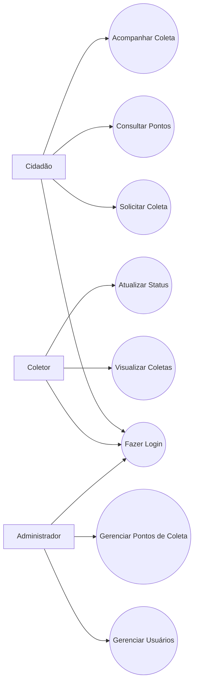
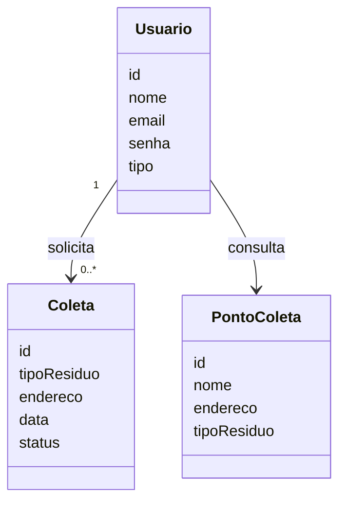
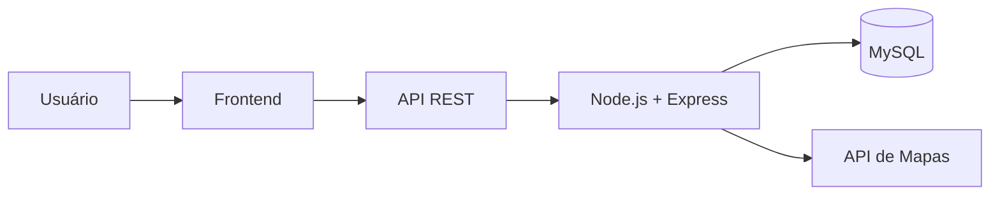

# EcoColeta — Sistema de Gestão de Resíduos e Coleta Seletiva

## Sobre o Projeto

O **EcoColeta** é um sistema para cidades inteligentes que busca facilitar a coleta seletiva. O cidadão poderá solicitar coletas, consultar pontos de descarte e acompanhar suas solicitações.

---

# Parte 1 — Engenharia de Requisitos

## Requisitos Funcionais (RF)

* **RF01:** Permitir cadastro e login de usuários.
* **RF02:** Permitir que o cidadão solicite uma coleta.
* **RF03:** Mostrar pontos de coleta seletiva.
* **RF04:** Permitir acompanhar o status da coleta.
* **RF05:** Permitir que o coletor visualize as coletas.
* **RF06:** Permitir que o coletor atualize o status da coleta.
* **RF07:** Permitir que o administrador gerencie usuários e pontos de coleta.

## Requisitos Não Funcionais (RNF)

* **Desempenho:** As principais ações deverão responder em até 2 segundos.
* **Segurança:** Utilização de HTTPS, senhas protegidas por hash e controle de acesso.
* **Confiabilidade:** Realização de backups periódicos do banco de dados.
* **Portabilidade:** O sistema deverá funcionar em computadores, tablets e celulares.
* **Usabilidade:** A interface deverá ser simples e fácil de utilizar.

## Interpretação dos Requisitos

O sistema busca resolver a dificuldade de encontrar locais corretos para descarte de resíduos e de solicitar coletas. O EcoColeta centraliza essas funções, facilitando a comunicação entre cidadãos, coletores e administradores.

---

# Parte 2 — Modelagem e Linguagem de Projeto

## Diagrama de Casos de Uso



## Diagrama de Classes



As principais classes são **Usuário**, **Coleta** e **Ponto de Coleta**. Um usuário poderá realizar várias solicitações de coleta e consultar diferentes pontos de descarte.

---

# Parte 3 — Qualidade, UX e Segurança

## Qualidade e Segurança

Para garantir a segurança e integridade dos dados serão utilizadas:

* Senhas protegidas por hash;
* Comunicação por HTTPS;
* Controle de acesso por tipo de usuário;
* Validação dos dados enviados;
* Backups do banco de dados;
* IDs únicos para usuários e coletas.

Cada perfil terá permissões diferentes. O cidadão terá acesso às suas coletas, o coletor poderá atualizar serviços e o administrador poderá gerenciar o sistema.

## Interface do Usuário (UX)

A interface será simples, com botões grandes, textos claros e poucas opções por tela.

### Wireframe — Login

```text
+-----------------------------+
|          ECOCOLETA          |
|                             |
| E-mail: [______________]    |
|                             |
| Senha:  [______________]    |
|                             |
|        [ ENTRAR ]           |
|                             |
|        Criar conta          |
+-----------------------------+
```

### Wireframe — Tela Inicial

```text
+-----------------------------+
|          ECOCOLETA          |
|                             |
| Olá, usuário!               |
|                             |
| [ SOLICITAR COLETA ]        |
|                             |
| [ PONTOS DE COLETA ]        |
|                             |
| [ MINHAS COLETAS ]          |
|                             |
+-----------------------------+
```

As telas possuem apenas as funções principais para facilitar a navegação e tornar o sistema simples de utilizar.

---

# Parte 4 — Arquitetura, Conectividade e Tecnologias

## Tecnologias

**Frontend:**

* HTML;
* CSS;
* JavaScript.

**Backend:**

* Node.js;
* Express.

**Banco de Dados:**

* MySQL.

**Controle de versão:**

* Git e GitHub.

Essas tecnologias foram escolhidas por serem simples, conhecidas, possuírem boa documentação e permitirem criar um sistema web compatível com diferentes dispositivos.

## Arquitetura



O frontend será responsável pelas telas do sistema. O backend processará as solicitações e realizará a comunicação com o banco de dados.

## Interoperabilidade

O sistema utilizará uma **API REST** para realizar a comunicação entre frontend e backend.

Também poderá utilizar uma API externa, como **Google Maps ou OpenStreetMap**, para mostrar a localização dos pontos de coleta.

Alguns exemplos de rotas da API:

```text
POST /login
POST /coletas
GET /coletas
GET /pontos-coleta
PUT /coletas/:id
```

Essa estrutura também permite que futuramente outros sistemas ou aplicativos sejam integrados ao EcoColeta.

---

# Conclusão

O EcoColeta é uma proposta simples para melhorar a gestão de resíduos e a coleta seletiva. O sistema reúne cidadãos, coletores e administradores em uma única plataforma, oferecendo segurança, facilidade de uso e possibilidade de integração com outros serviços.
